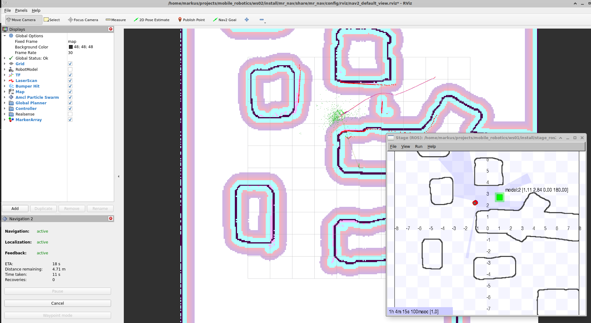

The first exercise involves nearly no programming. The goal of this assignment is to prepare you and your system for the upcoming assignments. It is divided into three parts.

1. Simulation Change the world (40 Points)
2. ROS2 navigation2 (50 Points)
3. Documentation (10 Points)

# 1 Simulation Change the World (40 Points)
Prepare your system according to the [Installation and Setup](https://tuwel.tuwien.ac.at/mod/page/view.php?id=1831276) description in TUWEL. You should be able to load a simulated environment like the cave and to drive the robot using `teleop_twist_keyboard` node.

## 1.1 tmux (5 Points)
__tmux__ is an important tool. Therefore, we like you to get familiar with the shortcuts.

Use _tmux_ with mouse support to manage your terminals. Memorize and document the five important short-cuts for you. Tell us how you enabled the mouse integration and how you can use the middle button for copy and paste, how to split the screen vertical or horizontal, how to detach and attach to sessions, ....

## 1.2 teleop_twist_keyboard (5 Points)
Now lets drive. Use a screenshot to document that you were able to drive with `teleop_twist_keyboard`

## 1.3 Stage (30 Points)
In the first part you have to get to know how the simulation, called Stage, works and how to change it. Make a copy of the cave.world file and change it in such a way that it looks like your favorite environment. For example, I created a Bender environment. Your documentation must contain a screenshot of your environment and in addition, you have to tell us in a few sentences (2-3) how you did it. The world file nearly explains itself, but if you like to know more, have a look at: <http://rtv.github.io/Stage/> (be aware that there is an old version of Stage on SourceForge).


&nbsp;&nbsp;


# 2 Nav2 (50 Points)
The [ROS2 nav2](https://navigation.ros.org/) includes nodes to

* Create a map using a SLAM approach (slam_toolbox),
* Save the map (map_saver),
* Publish a map (map_server),
* Self localize (amcl),
* Navigate (move_base).

Your task is to use these packages to navigate between two points and to document your approach briefly. Screenshots and 2 sentences are normally enough, but you might have to explain what you did in your submission talk.

## 2.1 Prerequisites

> Note: this step is not needed if you are using the Virtual Box

### Install ROS2 Navigation and tools
You have to install slam_toolbox (gmapping), amcl, map-server, navigation2 and rviz.

```sh
sudo apt-get update
sudo apt-get install -y \
    ros-$ROS_DISTRO-teleop-tools \
    ros-$ROS_DISTRO-slam-toolbox \
    ros-$ROS_DISTRO-mouse-teleop \
    ros-$ROS_DISTRO-navigation2 \
    ros-$ROS_DISTRO-nav2-bringup
```

## 2.2 RViz (10 Points)
Start the simulation and run RViz to visualize data and drive around using the teleop node as described in Installation Environment description.
```sh
ros2 run rviz2 rviz2 
```
Define __base_link__ as *Fixed Frame* and add the LaserScan (topic: __base_scan__) as well as TF.


## 2.3 slam_toolbox (10 Points)
Create a map using the slam_toolbox of your created environment, not from the cave environment. Visit <https://navigation.ros.org/tutorials/docs/navigation2_with_slam.html> to find the correct command to start mapping. To see the result, you have to add the map topic to your RViz view and to change the Fixed Frame to map. 


__Hints:__ 

- It helps to use *tmux* instead of multiple terminal windows or tabs. You need at least five terminals!
 - `ros2 launch stage_ros2 stage.launch.py`
 - `ros2 run rviz2 rviz2`
 - `ros2 run teleop_twist_keyboard teleop_twist_keyboard`
 - `your command for mapping`
 - `to save the map (next point)`
- Checkout the readme.md to the mr_nav project in your workspace! There is a working configuration!!

## 2.4 map_saver (5 Points)
Now you can save your created map using the map_server node and the command documented on <https://index.ros.org/p/nav2_map_server/>. Do not overwrite the cave map! Make your own map!
```sh
ros2 run nav2_map_server map_saver_cli -f [-f mapname]
```

## 2.5 map_server (5 Points)
Stop using mapping and start the map_server to publishing your created map as described on <https://index.ros.org/p/nav2_map_server/>.
Open the created map with an editor, such as gimp, and fix holes if needed.

__Hints:__ 
 
- <https://answers.ros.org/question/406036/how-to-publish-map-in-ros2-galactic/>
- pay attention to the indentations in the configuration file
- Do not forget to send the lifecycle messages from a separate console

## 2.6 AMCL Self Localization (10 Points)
AMCL should be used for self-localization to establish a link between your map and the robot base. Details can be found on <https://github.com/ros-planning/navigation2/tree/main/nav2_amcl>. Sorry, the ros2 doc is not very detailed :-( .
The following command will start the self localization. But it won't work, you have to define first an initial pose using RViz and the 2D Pose Estimate button.
```sh
ros2 launch tuw_nav2 localization_launch.py map:=$ROS2_CAR_DIR/.......
```
Now you can drive using the teleop node, and you will hopefully see the robot on the correct spot. The particles used for the self localization can be visualized as PoseArray from the topic ParticleCloud.
You will receive 9 Points for the working amcl and 1 point if you can drive with mouse_teleop as shown in the screenshot.


## 2.7 Nav2 (5 Points)
The navigation package is a very complex, therefore will just provide you with a working launch file.
```sh
ros2 launch tuw_nav2 navigation_launch.py
```
After you launched move_base, you should be able to tell the robot where it should go (1 Point) using the 2D Nav Goal button in RViz.
To get some indication of what is going on, you can view the cost maps (2 Points) as well as the path (2 Points).




## 2.8 Tweaking move_base (4 Points)
Checkout navigation stack https://navigation.ros.org/, and you will see how complex the navigation stack is. A good way to tweak it is to check have a look at the navigation_launch.py and the parameter files used there.

## 2.9 Launch File (1 Point)
Create one ros2 python launch file, not a bash script, to start everything, except the simulation environment. This is a very heavy task for beginners and I expect only view people manage it.  

# 3 Documentation (10 Points)
Your documentation should not be more than 5-6 pages (1 Point) - primarily screenshots (Alt-Print or Shift Print). In this assignment, it will be the only thing you have to submit, no code.
Just document every step with screenshots, for the task 2.8 and 2.9 you can add the files with a brief inline documentation (7 Points).
The first page includes your full name and student ID, and a table showing how many points you reached. (2 Points)

# 4 Optional exercises and extra points​ (3 Points)
## 4.1 Optional exercises
Work through the [Using turtlesim and rqt](https://docs.ros.org/en/humble/Tutorials/Beginner-CLI-Tools/Introducing-Turtlesim/Introducing-Turtlesim.html).

## 4.2 Extra points
Document the following tasks in your Documentation to get points.

* Use `rqt_graph` to visualize the nodes running (1 Point) 
* Use `rqt_plot` to plot the history of selected forward velocities and rotational velocities (1 Point) 
* Document the pushing frequents of the *twist* message on *cmd_vel* using `ros2 topic` (1 Point) 
